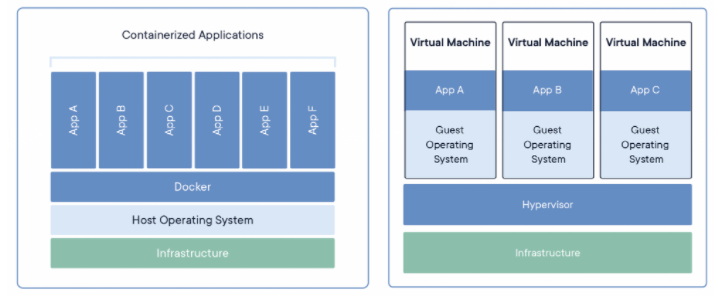

# Today I Learned / 2022.07.06
```
TIL을 작성할 때 사용하게 될 Markdown 문법을 잘 찾아보면서 금일 실전코딩 수업에서 배운 Docker에 대해 간략히 소개를 하는 것을 목표로 한다. 이번 TIL은 Docker의 내용을 다루지만 Markdown 문법을 사용하여 깔끔하게 정보를 정리하는 것에 집중한다.
```

# Docker


## 도커란?
도커는 애플리케이션을 신속하게 구축, 테스트 및 배포할 수 있는 소프트웨어 플랫폼이다. 소프트웨어를 컨테이너라는 표준화된 유닛으로 패키징하는 것이 주된 목적이 된다. 컨테이너는 라이브러리, 시스템 도구, 코드 등 소프트웨어 실행에 필요한 모든 것이 포함되어 있다. **즉, 도커는 컨테이너 환경에서 독립적으로 애플리케이션을 실행할 수 있도록 컨테이너를 만들고 관리하는 것을 도와주는 도구이다.** 도커를 통해 애플리케이션을 실행하면 독립적인 환경에서 일관된 결과를 보장한다.

<br>

## 컨테이너
컨테이너는 격리된 공간에서 프로세스가 동작하는 기술이다. 기존의 가상화 방식인 OS 가상화가 아닌 프로세스 자체를 격리하는 방식으로 동작한다. 리눅스에서 프로세스를 격리하는 방식을 리눅스 컨테이너라고 한다. 단순히 프로세스를 격리하기 때문에 가볍고 빠르다. 또한 CPU나 메모리는 프로세스가 필요한 만큼만 추가 사용하여서 성능적으로 거의 손실이 없다. 아래 그림은 도커(왼쪽)와 가상머신(오른쪽)을 나타낸 것이다.



출처 : [https://www.docker.com/resources/what-container/]

[https://www.docker.com/resources/what-container/]: https://www.docker.com/resources/what-container/

### 컨테이너의 특징

* 서버에 여러 컨테이너를 실행하면 독립적으로 실행되어 VM(Virtual Machine)을 사용하는 느낌을 준다.
* 실행 중인 컨테이너에 접속하여 명령어를 입력할 수 있다.
* 'apt-get'이나 'yum'등 운영체제에서 사용하는 패키지 매니저를 통해 설치할 수 있고 사용자도 추가하고 프로세스를 백그라운드로 실행할 수 있다.
* CPU나 메모리 사용량을 제한할 수 있다.
* 호스트의 특정 포트와 연결하거나 호스트의 특정 디렉토리를 내부 디렉토리인 것처럼 사용이 가능하다.
* 새로운 컨테이너를 만드는데 1~2초로 매우 빠르다.

<br>

## 이미지
컨테이너 실행에 필요한 파일과 설정을 포함하고 있는 것으로 상태값을 가지지 않고 변하지 않는다. 컨테이너는 이미지를 실행한 상태이다. 추가되거나 변하는 값은 컨테이너에 저장된다. 같은 이미지에서 여러 개의 컨테이너를 만들 수 있고 컨테이너의 상태가 바뀌거나 삭제되어도 이미지는 변하지 않고 그대로 남아있다. 도커 이미지는 Docker hub에 등록하거나 Docker Registry 저장소를 직접 만들어 관리할 수 있다.

### 이미지의 특징
* 가상머신보다 작은 용량을 가지고 있다.
* 상태값을 가지지 않고 변하지 않는다.
* 하나의 이미지를 통해 여러 컨테이너를 생성할 수 있고, 컨테이너를 삭제해도 이미지를 변하지 않는다.
* 이미지들은 Docker Hub를 통해 버전 관리 및 배포가 가능하다.

<br>

## Dockerfile
도커 이미지를 만들기 위해 Dockerfile이라는 파일에 DSL(Domain Specific Language) 언어를 이용해 이미지를 생성할 수 있다. 단순 텍스트 파일로 일반적으로 소스와 함께 관리한다. 서버에서 프로그램을 설치하려고 할 때 Dockerfile 을 통하여 관리하면 된다. Dockerfile에서 사용할 수 있는 키워드는 20개 정도 있다. 여기서 중요한 건 FROM 과 RUN 이다. FROM 과 RUN 으로 이미지를 만들 수 있다.

* FROM
```
FROM <image>:<tag>
FROM ubunto:16.04
```
베이스 이미지를 지정한다. 반드시 베이스 이미지를 지정해야 하며 어떠한 이미지도 베이스 이미지가 될 수 있다. tag는 버전을 지정하는 것으로 가능하면 구체적인 버전을 지정하는 것이 좋다.

* RUN
```
RUN <command>
RUN bundle install
```
가장 많이 사용하는 구문 중 하나로 말 그대로 명령어를 실행한다. 내부적으로 /bin/sh -c 뒤에 명령어를 실행하는 방식

## 도커 명령어
도커를 실행하는 명령어는 다음과 같다.
```
docker run [OPTIONS] IMAGE[:TAG|@DIGEST] [COMMAND] [ARG..]
```
자주 사용하는 옵션
<!-- Markdown -->
옵션|설명
-|-
-d|detached mode 흔히 말하는 백그라운드 모드
-p|호스트와 컨테이너의 포트를 연결 (포워딩)
-v|호스트와 컨테이너 디렉토리를 연결 (마운트)
-e|컨테이너 내에서 사용할 환경변수 설정
-name|컨테이너 이름 설정
-rm|프로세스 종료시 컨테이너 자동 제거
-it|-i와 -t를 동시에 사용한 것으로 터미널 입력을 위한 옵션
-link|컨테이너 연결

run 명령어를 사용하면 사용할 이미지가 저장되어 있는지 확인하고 없으면 다운로드를 한 후 컨테이너를 생성하고 시작한다.
```
docker run --rm -it ubuntu:16.04 /bin/bash
```
컨테이너 내부에 들어가기 위해 뒤에 /bin/bash 를 붙이고 키보드 입력을 위해 -it 옵션을 준다. 추가로 프로세스가 종료되면 컨테이너가 자동 삭제 되도록 --rm 옵션도 추가했다.

<br>

## 컨테이너 명령어

### 컨테이너 목록 확인하기(ps)
컨테이너 목록을 확인한다.
```
docker ps [OPTIONS]
```
ps 명령어는 실행 중인 컨테이너 목록을 보여준다.

-a 옵션은 종료된 컨테이너까지 목록으로 보여준다. 컨테이너는 종료되어도 삭제되지 않고 남아있다.

<br>

### 컨테이너 중지하기(stop)
실행 중인 컨테이너를 중지하는 명령어, 실행 중인 컨테이너를 하나 또는 그 이상을 중지할 수 있다. (띄어쓰기로 구분)
```
docker stop [OPTIONS] CONTAINER [CONTAINER...]
```
> 도커 ID의 길이는 64자리이다. 명령어의 인자로 전달할 때는 전부 입력하지 않아도 된다.

<br>

### 컨테이너 제거하기(rm)
종료된 컨테이너를 제거하는 명령어, 종료된 컨테이너를 하나 또는 여러 개 삭제할 수 있다.
```
docker rm [OPTIONS] CONTAINER [CONTAINER...]
```
> docker rm -v $(docker ps -a -q -f status=exited) 명령어를 입력하면 중지된 컨테이너 ID를 가져와서 한 번에 삭제한다.

<br>

### 컨테이너 로그 보기(logs)
컨테이너가 정상적으로 동작하는지 확인하는 좋은 방법. 로그를 확인하는 방법
```
docker logs [OPTIONS] CONTAINER
```
--tail 마지막 줄부터 몇 줄을 출력할지 설정할 수 있다. ( ex, --tail 10)

-f 실시간으로 생성되는 로그를 볼 수 있다.

<br>

### 컨테이너 명령어 실행하기(exec)
실행중인 컨테이너에 들어가보거나 컨테이너 파일을 실행하고 싶을때 사용한다. 컨테이너 명령어를 실행하는 방법
```
docker exec [OPTIONS] CONTAINER COMMAND [ARG..]
```

<br>

## 이미지 명령어
### 이미지 목록 확인하기(images)
도커가 다운로드한 이미지 목록을 보는 명령어
```
docker images [OPTIONS] [REPOSITORY[:TAG]]
```

<br>

### 이미지 다운로드하기(pull)
이미지를 다운로드 하는 명령어
```
docker pull [OPTIONS] NAME[:TAG|@DIGEST]
```
run 명령어를 입력하면 이미자가 없을 때 자동 다운이 된다. pull 명령어는 최신버전 다운로드를 할 경우 사용한다.

<br>

### 이미지 삭제하기(rmi)
이미지를 삭제하는 방법(컨테이너가 실행중인 이미지는 삭제되지 않는다.)
```
docker rmi [OPTIONS] IMAGE [IMAGE...]
```

<br>

<hr/>

## 정리
도커에 대한 정보를 검색하고, 습득한 정보를 Markdown 문법을 통해 Github로 가져오는 과정에서 최근에 학습한 Markdown을 상기시키며 활용할 수 있었고, 금일 실전코딩 수업에서 다룬 도커의 개념에 대해 조금 더 복습하는 시간을 가졌다. 아직 도커가 어떻게 구체적으로 사용되고 활용되는 지, 어째서 기업에서 도커를 알고, 다룰 줄 아는 개발자들을 우대하는 지는 아직 잘 모르겠다. 내일 진행될 실전코딩 수업과 다음 TIL에서는 이와 같은 내용도 추가하도록 하겠다.

## 참고

* [docker](https://www.docker.com/resources/what-container/)