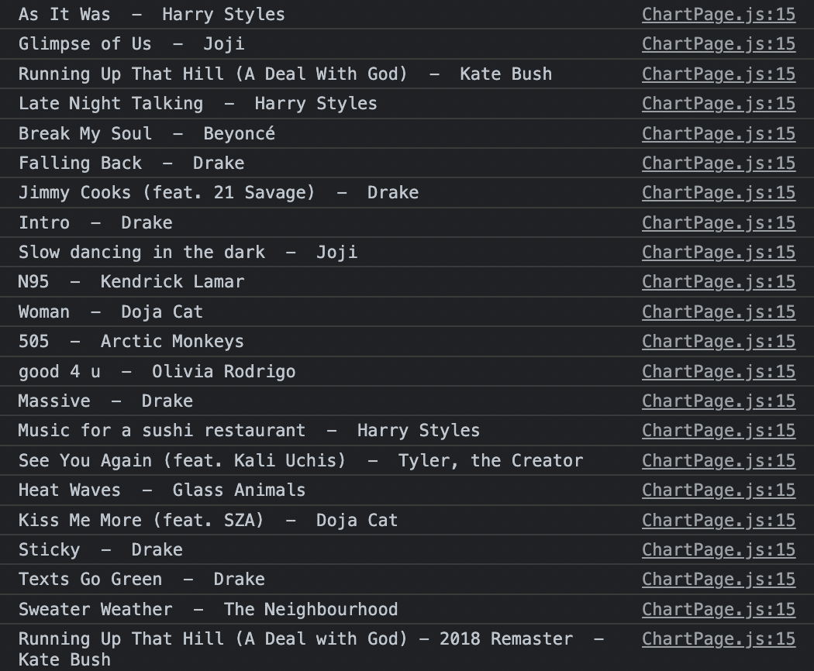

# Today I Learned / 2022.07.14
서투르지만 실전코딩1에서 배웠던 Javascript와 React.js의 문법을 활용하여 버튼을 만들고, 버튼을 누르면 해외 음원 차트를 로그로 출력하는 법을 공부하였다. 구글 웹서핑을 통해 여러 음원 사이트의 음원 API를 검색하고, API를 어떻게 활용하는지, 그렇게 얻은 json파일에서 어떻게 해야 내가 원하는 정보만을 파싱할 수 있는지 공부했고, 직접 콘솔창에 띄워보기도 하였다.

```
    const handleChart = (event) => {
        event.preventDefault();
        fetch(`https://ws.audioscrobbler.com/2.0/?method=chart.gettoptracks&api_key=49a536c22c27b425d2fcc6f9778ba22e&format=json`)
        .then(response => response.json())
        .then(response => {
            let musicList = response.tracks.track;
            for (let i = 0; i < musicList.length; i++) {
                let albumTitle = musicList[i]["name"]
                let albumArtist = musicList[i]["artist"]["name"]
                console.log(albumTitle, ' - ', albumArtist)
            }
        }).catch(e => console.log('Failed to load chart data.'));
    }
    
    return (
        <button onClick={handleChart}>Music Chart TOP 100</button>
    )
```

