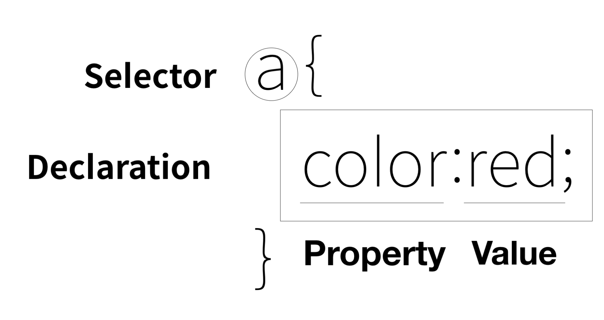

# Today I Learned / 2022.08.04
```
이번 시간에는 본격적인 자바스크립트를 공부하기 앞서 HTML과 CSS의 개념을 다시 한 번 잡아보는 시간을 가지기로 했다.
모든 HTML의 태그와 CSS의 문법을 다루기보다, 감을 되찾는 정도의 공부만 하고 나머지는 자바스크립트를 공부한 후에 실전코딩, 클론코딩을 하며 계속 배워갈 예정이다.
사실 HTML같은 경우 마크업 언어이기 때문에 지금 포스트와 같이 TIL을 작성할 때도 유용하게 사용하는 언어여서 익숙하지만, 
CSS는 항상 사용하는 속성을 제외하고는 익숙하지 않은 속성들도 많기에 검색을 활용하는 것에 익숙해져야 할 것 같다.
```

# HTML


## HTML 기본 형태

```
<!DOCTYPE HTML>
<html>
    <head>
        <meta charset="UTF-8"/>
        <title> WEB TITLE </title>
    </head>
    <body>
    </body>
</html>
```
!DOCTYPE HTML은 이 문서에는 HTML이 담겨있다는 뜻으로 관용적으로 사용한다. 그 밑에는 html태그로 head와 body태그를 감싸고 있다. head에는 웹페이지의 제목인 title태그와 charset 등을 선언해줄 수 있는 meta태그가 있다.

<hr>

## 줄바꿈 태그

* br

```
<br>
```
가장 대표적으로 줄바꿈을 하기위해 사용하는 태그이다. 줄바꿈이라는 시각적인 의미만을 가지고 있기 때문에 뭔가를 감쌀 필요가 없다.

* p
```
<p> </p>
```
Paragraph의 앞글자를 따서 p 태그를 사용한다. 단락으로 묶기 때문에 p 태그는 br태그와 다르게 어디까지가 한 단락인지를 표현할 수 있기 때문에 열리는 태그와 닫히는 태그가 존재한다. 

>p 태그와 br 태그를 비교했을 때 p 태그는 정해진 여백만큼 벌어지기 때문에 시각적으로 자유도가 떨어진다. 이럴때 CSS 문법을 사용하게 된다. 나중에 천천히 배우겠지만, 단락과 단락사이의 여백을 더 주고 싶을때 예를 들어 밑에 단락의 p태그에 아래와 같이 작성하면 된다.
```
<p style="margin-top:40px;"> ... </p>
```

<hr>

## 이미지 태그
```

```

경로에는 인터넷에서 이미지 주소 복사를 해서 붙여넣어도 되고, 파일의 로컬 경로를 넣어도 좋다. width는 기본적으로 100%로, 해당 속성을 쓸 경우 상대적으로 크기가 변한다.

<hr>

## 목록 태그

목록을 작성할때 단순하게 한 줄씩 쓰고 br태그를 사용할 수도 있지만 이건 의미에 맞게 사용된 것이 아니다. 이럴때는 li 태그를 사용한다.
```
<li>1</li>
<li>2</li>
<li>a</li>
<li>b</li>
```
<li>1</li>
<li>2</li>
<li>a</li>
<li>b</li>

이 때, 리스트를 여러개를 붙이게 될 경우 구분이 가지 않기 때문에 띄어쓰기를 하고싶다. <br> 이때 사용하는 것이 li의 태그의 부모인 ul 태그이다.
```
<ul>
    <li>1</li>
    <li>2</li>
</ul>
<ul>
    <li>a</li>
    <li>b</li>
</ul>
```
<ul>
    <li>1</li>
    <li>2</li>
</ul>
<ul>
    <li>a</li>
    <li>b</li>
</ul>

> 즉, li 태그는 어디서부터 어디까지가 연관된 항목인지 구분하기 위한 부모 태그가 반드시 필요하다. ul은 Unordered이고, ol은 Oldered이다. 

<hr>

## 테이블 태그

테이블을 만들 때에도 리스트와 동일하게 부모 속성을 사용한다. table태그 안에 tr(table row)로 행의 개수를 정하고, 그 안에서 td로 열의 개수만큼 선언한다.
```
<table>
    <tr>
        <td>head</td>
        <td>98.1%</td>
    </tr>
    <tr>
        <td>body</td>
        <td>97.9%</td>
    </tr>
    <tr>
        <td>html</td>
        <td>97.9%</td>
    </tr>
</table>
```
<table>
    <tr>
        <td>head</td>
        <td>98.1%</td>
    </tr>
    <tr>
        <td>body</td>
        <td>97.9%</td>
    </tr>
    <tr>
        <td>html</td>
        <td>97.9%</td>
    </tr>
</table>

<hr>

## 링크 태그

링크 태그는 Anchor의 첫 글자를 딴 a태그를 이용한다. 

```
<a href="https://www.w3.org/TR/html5/" target="_blank" title="specification"> ... </a>
```

### 속성

<table>
    <tr>
        <td>href</td>
        <td>Hypertext의 h와 Reference의 ref를 딴 href 속성을 사용하여 닻을 내릴 링크를 내린다.</td>
    </tr>
    <tr>
        <td>target</td>
        <td>_blank로 새 탭에서 열릴 수 있게 해준다.</td>
    </tr>
    <tr>
        <td>title</td>
        <td>링크에 커서를 올리면 나타는 툴팁을 제시할 수 있다.</td>
    </tr>
</table>

# CSS


## 개요

### CSS의 등장

웹 브라우저가 처음 나왔을 떄 웹 브라우저는 HTML만을 해석해서 처리하는 프로그램이었다. 하지만 인터넷이 발달하고 웹 페이지를 아름답게 디자인하려는 니즈에 맞게 스타일링을 위한 새로운 언어가 등장하였는데 그것이 바로 CSS이다. CSS는 HTML의 문법인 style 태그를 사용하여 style 태그 내부에 HTML의 스타일을 정의하는 방식으로 스타일링을 한다.

### CSS의 장점

* 중복 제거 -> 가독성 증가, 유지 보수 용이

HTML에도 꾸밈을 위한 태그가 있긴 하였다. 예를 들자면 font 태그가 있겠다. 하지만 HTML은 태그안에 내용물을 넣어야 했기 때문에 1억개가 넘는 텍스트에 font 태그를 사용한다면 모든 텍스트마다 태그를 붙여야했었다. 만약 그 폰트의 스타일을 변경하고 싶다면, 마찬가지로 1억개의 font 태그의 속성을 전부 수정해야만 했다. 게다가 수정하는 도중 바꾸면 안되는 태그나 속성을 건드리게 될 수도 있다. CSS는 이런 비극을 style 태그를 사용하여 미연에 방지한다.

* HTML 코드에 디자인의 코드가 들어가지 않게 된다.

디자인과 관련된 코드들은 모두 style 태그 안에 갇혀있기 때문에 HTML이 정보 전달에만 전념하도록 한다.

<hr>

## CSS의 기본 문법
<ol>
<li>style 태그를 쓴다.</li>
style 태그를 쓰는건 앞서 설명한대로 HTML의 style 태그 내부에 해당하는 태그나 클래스 등의 스타일링을 하는 것을 말한다.

```
<style>
    a {
        color: black;
    }
</style>
```

> 위와 같은 코드는 해당하는 효과를 누구에게 줄 것인가를 선택한다는 점에서 선택자(selector)라고 한다. 선택자에 지정될 효과를 효과 혹은 declaration이라고 부른다.

</img>

<li>style 속성을 쓴다.</li>

style=""라는 HTML의 속성은 값으로 반드시 CSS 효과가 들어온다. 이처럼 style 속겅을 직접 사용한 경우에는 style 속성이 위치한 태그에 효과를 적용하기 때문에 선택자라는 것을 사용할 필요가 없다.

```
<a href="index.html" style="color:red">INDEX PAGE</a>
```

</ol>


